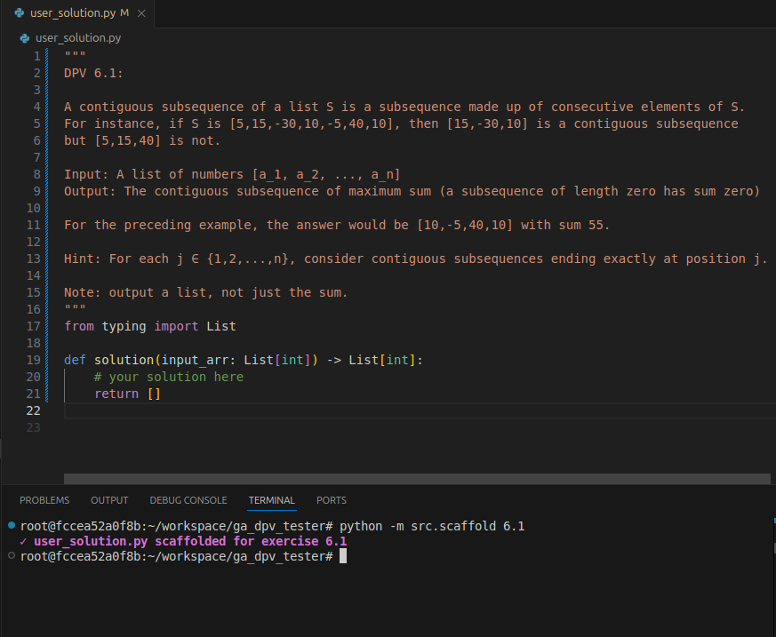

# DPV Algorithms Tester

A helper tool for studying algorithms from the Dasgupta, Papadimitriou, and Vazirani (DPV) textbook (1st edition), particularly for Georgia Tech's CS6515 course.

This repository provides scaffolding for implementing and testing DPV problem solutions, with test suites and solution templates. Updated regularly as I progress through the course material, it helps verify understanding of algorithmic concepts and prepare for exams through systematic practice.

## Usage

```bash
# Scaffold a solution template for an exercise
python -m src.scaffold <exercise_number>

# Test your solution against exercise test cases  
python -m src.test_runner <exercise_number>
```

## Usage Examples
- **Scaffolding**:



- **Testing**:


## Solutions
This directory contains my solution attempts for the DPV exercises. Please note that these are personal implementations and may contain errors or suboptimal approaches. When in doubt, always refer to the official book solutions or trusted academic sources for verified correctness.